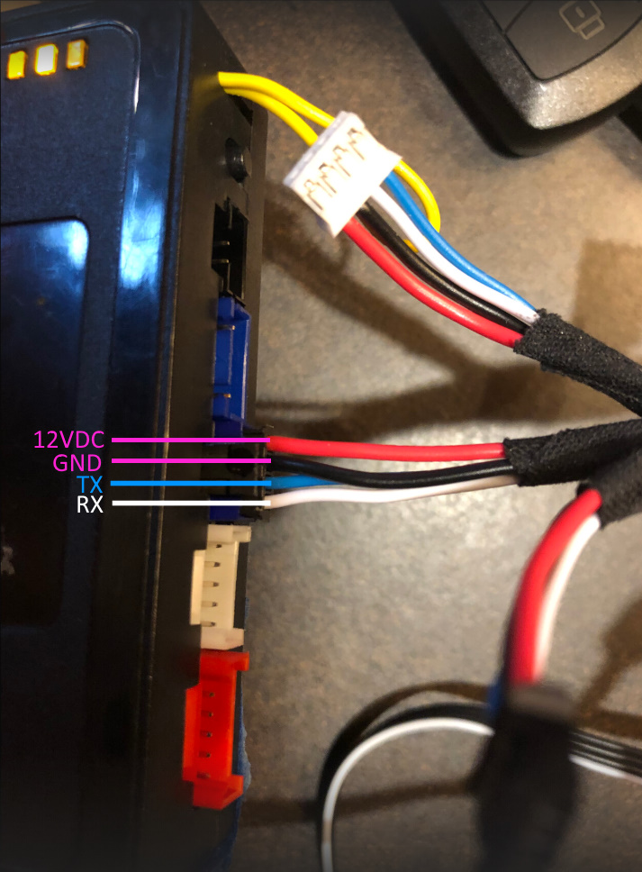

# Open Remote Start

A Particle project for interfacing with fortin remote starter and car alarm systems
via the antenna data-link interface.

## Why

This poject originated as a means to capture, analyze, and explore the data-link
protocol used by Fortin remote starters and alarm system. A unintended, but 'fun'
side effect of this work was a code base which could be used as a cellular remote
or wifi remote for the system. 

## What you will need

Ok, so you don't need any of this, but this is what I found worked best for me.

[2 diodes](https://www.sparkfun.com/products/8589) if you are hooking up mulitple
attennas to the data-link bus all but the primary antenna should have a diode on
the tx line. If you don't plan on impersonating the remote starter you only need
one diode.

[Level Shifter](https://www.sparkfun.com/products/12009) Particle MCUs (Boron, Photon, Electron...)
use 3.3v logic levels. While the Fortin remote starter uses a 5v logic level. Thus if
you don't want to fry your Particle you will need to convert the 5v signal from the
remote starter to a 3.3v signal and vice-versa.

[Electron](https://store.particle.io/collections/cellular/products/electron-3g-americas) (discontinued) or
[Photon](https://store.particle.io/collections/wifi/products/photon) (discontinued) or
[Boron](https://store.particle.io/products/boron-lte-cat-m1-noram-with-ethersim-4th-gen): The Electron has more
uarts than the Boron or Photon, as such it is capable of monitoring the data-link connection in
both directions.

[5v regulator](https://www.sparkfun.com/products/107) If you are using an Electron, you
will need some way to provide a 5v reference to your level shifter. DO NOT use this to
power the Boron or Photon from the data-link 12v-14v source. If you need to power the Boron or Photon, you
should use a buck down DC->DC power supply, or other USB power source.

[Particle Asset Tracker](https://store.particle.io/products/asset-tracker-v2-components) (discontinued)
If you want to add a gps/accelerometer to your set up.

## How to connect to Fortin Evo-One

This image shows the pinout of the data-link port on the Fortin Evo-One

This schematic for using electron with ORS

## A note on licensing

While the code written for the ORS project is distributed under the BSD 3 clause license
depending on how this project is compiled it may include the AssetTrackerRK
library which is under a different license. If you intend on distributing a compiled
version of this code please respect the licenses of all dependencies.
